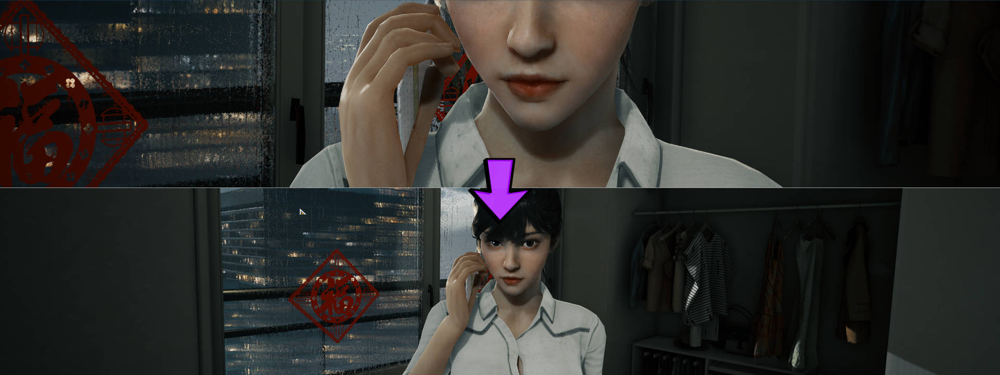

## Bright Memory: Infinite ultrawide and wider
The solution addresses the vertical field of view reduction at the cutscenes at 21:9 and wider resolutions.

1. [Download the archive](/../../releases).
2. Unpack the files to the \BrightMemoryInfinite\Binaries\Win64\ folder inside the game directory.

To uninstall, simply remove or move the files.

Tested on the latest Steam version at 2560x1080, 3840x1080 and 5760x1080.

You can buy me a [coffee](https://ko-fi.com/rozziroxx) or become a [patron](https://www.patreon.com/rozzi).

